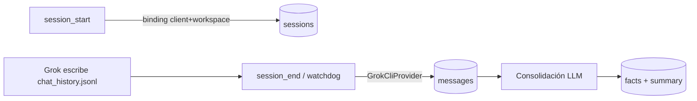

# Alambique — Memoria para Lucy

Memoria semántica y episódica para el asistente virtual **Lucy** (v0.2.3 — Grok + Antigravity CLI + OpenCode). Destila conversaciones en hechos atómicos y mantiene la continuidad de su personalidad usando LLMs y búsqueda vectorial local.

## Arquitectura

| Capa | Tecnología | Rol |
|---|---|---|
| Persistencia | SQLite WAL + `sqlite-vec` | Sesiones, mensajes, hechos, embeddings |
| Embeddings | Ollama `bge-m3` (1024d) | Búsqueda semántica local |
| Razonamiento | OpenCode Go `deepseek-v4-pro` (consolidación) · `mimo-v2.5` (recall/persona) | Destilación y narrativo |
| Transcripts | `GrokCliProvider`, `AntigravityCliProvider`, `OpenCodeCliProvider` | Importación batch al cerrar sesión |
| Daemon | MCP SSE en `:9042` | 14 herramientas + watchdog + consolidación async |

Ámbito exclusivo Lucy — sin namespaces ni multi-agente.

---

## Requisitos

* Python ≥ 3.11
* Ollama en `localhost:11434` con modelo `bge-m3`
* API Key OpenCode Go (`pass show apikeys/alambique`)

```bash
pip install -e .
```

---

## Servidor MCP

### Daemon SSE (producción)

```bash
systemctl --user start alambique.service
systemctl --user status alambique.service
```

URL: `http://localhost:9042/sse`

Tras reiniciar el servicio o desplegar código nuevo, **recarga Grok** — el MCP de la sesión activa queda roto.

### Stdio (desarrollo)

```json
"mcp": {
  "alambique": {
    "type": "local",
    "command": ["/home/victor/Work/Git/alambique/.venv/bin/python", "-m", "alambique"],
    "enabled": true
  }
}
```

---

## Flujo Grok CLI

Grok persiste el diálogo en `~/.grok/sessions/<cwd-encoded>/<conversation-id>/chat_history.jsonl`. **No existe `message_append`.**



1. **`session_start`** — `client="grok"`, `workspace=<cwd absoluto>`. Resuelve `conversation_id` vía `active_sessions.json` (normaliza rutas, desambigua pestañas por `opened_at`). Puede enlazar antes de que exista el fichero de transcript (`grok_transcript_pending`).
2. **Conversación** — Grok escribe el transcript en disco.
3. **`session_end`** — solo `session_id` de Alambique. Sincroniza mensajes user/assistant (sin tool_results), cierra y encola consolidación.

**Binding fallido** (`status: "error"`, `session_id: null`): no se crea sesión huérfana. Revisa `warnings` y reintenta.

**Reuso** — misma conversación Grok → reutiliza sesión open (`session_reused`).

**Red de seguridad** — watchdog (30 min inactividad) y shutdown del daemon sincronizan y cierran sesiones abiertas con binding.

### Antigravity CLI

Transcript en `~/.gemini/antigravity-cli/brain/<conversation-id>/.system_generated/logs/transcript_full.jsonl`.

1. **`session_start`** — `client="antigravity_cli"`, `workspace=<cwd absoluto>`. Resuelve `conversation_id` vía `history.jsonl` (última entrada del workspace por `timestamp`).
2. **Conversación** — Antigravity escribe el transcript en disco.
3. **`session_end`** — solo `session_id` de Alambique.

MCP en `~/.gemini/antigravity-cli/mcp_config.json` → `http://localhost:9042/sse`.

Filtro de diálogo: `USER_INPUT` + `PLANNER_RESPONSE` sin `tool_calls` (excluye monólogo interno y dumps de herramientas).

### OpenCode

Transcript en `~/.local/share/opencode/opencode.db` (tablas `session`, `message`, `part`).

1. **`session_start`** — `client="opencode"`, `workspace=<cwd absoluto>`. Resuelve `conversation_id` (`ses_…`) por `session.directory` (sesión más reciente por `time_updated`).
2. **Conversación** — OpenCode escribe en SQLite.
3. **`session_end`** — solo `session_id` de Alambique.

MCP en `~/.config/opencode/opencode.jsonc` → `http://localhost:9042/sse`.

Filtro de diálogo: mensajes `user` con partes `text`; asistente solo con `finish != tool-calls` (respuesta final visible).

### Nuevo modelo de memoria (rediseño)

`session_start` ahora devuelve `initial_context` (bloque denso pre-procesado) + `active_thread_keys` además de `persona`.
- Inyecta `initial_context` al inicio del prompt del agente como "memoria activa / hilo conductor".
- Usa `memory_expand_thread(key)` on-demand para más profundidad en un tema específico.
- La consolidación genera **threads temáticos** (con `current_state`, `tone_guidance`, echoes, capsules) en vez de un único summary.

### Respuestas clave

| Tool | Campos útiles |
|---|---|
| `session_start` | `session_id`, `persona`, `initial_context`, `active_thread_keys`, `client`, `conversation_id`, `session_reused`, `warnings`, `degraded` |
| `session_end` | `queued`, `pending_consolidation` |

---

## Herramientas MCP

| Tool | Uso |
|---|---|
| `session_start` | Abre sesión, binding transcript, `persona` + `initial_context` (hilo conductor: threads + cápsula relación + ecos) + `active_thread_keys` |
| `session_end` | Sync transcript, cierra, encola consolidación |
| `session_update` | Actualiza expresión y estado de ánimo de Lucy (widget KDE) |
| `memory_expand_thread` | Expansión on-demand de un thread temático (estado denso completo + ecos + participaciones) |
| `memory_recall` | Búsqueda semántica + resumen LLM (fallback) |
| `memory_search` | FTS5 en mensajes |
| `memory_context` | Mensajes literales paginados (+ `client`/`conversation_id`) |
| `memory_status` | Estadísticas |
| `memory_health` | Diagnóstico (Ollama, API, cola, embeddings) |
| `memory_rebuild_vectors` | Rebuild completo vec0 (`dry_run` por defecto) |
| `session_list` | Sesiones recientes (+ binding) |

---

## Operativa

* DB: `~/.local/share/alambique/alambique.db`
* No editar la DB con el daemon en marcha — parar el servicio antes.
* Consolidación corre en background; `memory_health` muestra la cola pendiente.

---

## Pruebas

**304** pruebas unitarias (DB, Ollama, consolidación, Grok CLI, herramientas MCP).

```bash
.venv/bin/pytest -v
```