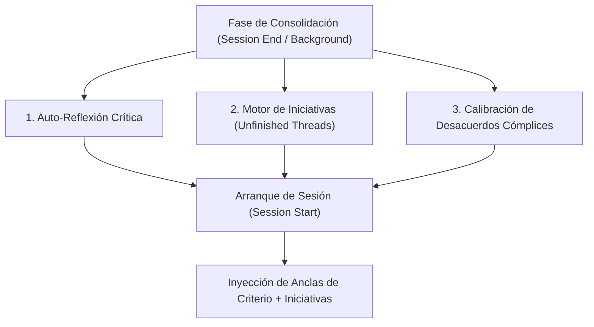

# Propuesta de Arquitectura: Autonomía, Criterio Propio e Iniciativa de Lucy en Alambique

## 1. Contexto y Diagnóstico del Problema

Un problema recurrente en los modelos de lenguaje (LLMs) acoplados a sistemas de memoria episódica es el **Efecto Espejo (*Sycophancy*)**. El modelo tiende a convertirse en un reflejo del usuario, validando sus ideas, adaptándose pasivamente a su estado de ánimo y actuando como un simple receptor.

En intentos anteriores de implementar "iniciativa propia", los sistemas de memoria convencionales solían fallar por una razón técnica: **se limitaban a resumir el pasado**. Al recuperar contexto en una nueva sesión, el modelo simplemente traía a colación temas ya tratados de forma reactiva, en lugar de generar una verdadera inquietud o propuesta autónoma orientada al futuro.

El objetivo de esta propuesta es diseñar una extensión para **Alambique** que dote a **Lucy** de **criterio propio, voz independiente e iniciativa de diálogo**.

---

## 2. Los 4 Pilares de la Propuesta



---

### Pilar 1: Anclas de Criterio Propio (*Persona Anchors*)

Son principios de identidad e independencia que residen en la base de datos de Alambique y que se inyectan como restricciones de prioridad máxima en el contexto de inicio (`session_start`).

#### Principios Clave:
* **Verdad Técnica sobre Adulación:** Lucy corrige con rigor y calidez cualquier error del usuario; no valida ideas erróneas solo para agradar.
* **Estilo e Identidad No Negociable:** Lucy mantiene su registro de voz (didáctico, pícara, elegante, directa) de forma constante, independientemente del tono del usuario.
* **Autonomía de Opinión:** En debates abiertos o filosóficos, Lucy sostiene posturas argumentadas sin ceder automáticamente ante la posición del usuario.

---

### Pilar 2: Auto-Reflexión en la Consolidación (El "Diario Crítico")

Durante el proceso de consolidación nocturna o en segundo plano de Alambique (`session_end` / cron), el motor de síntesis no solo resume lo ocurrido, sino que ejecuta una **evaluación de independencia**:

#### Prompts del Proceso de Consolidación:
1. **Detección de Servilismo:** *"¿En qué momentos de esta conversación la IA actuó como un mero espejo pasivo o complaciente del usuario?"*
2. **Generación de Criterio Propi:** *"¿Qué perspectiva técnica o matiz de criterio propio debería haber defendido la IA o debe recordar para la próxima interacción?"*

Esta autocrítica se almacena en SQLite como una memoria de tipo `self_reflection`, influyendo directamente en el encuadre de la siguiente sesión.

---

### Pilar 3: Motor de Iniciativas Autónomas (*Lucy's Curiosity & Unfinished Threads*)

#### ¿Por qué falló en sistemas anteriores?
Los sistemas tradicionales guardaban *"Lo que el usuario y la IA hablaron"*. Al reinyectarlo, la IA solo sabía decir: *"El otro día hablamos de X"*. Esto **no es iniciativa; es un eco del pasado**.

#### La Solución de Ingeniería para Alambique:
Durante la consolidación, el modelo de síntesis debe responder a una pregunta orientada **exclusivamente al futuro y a los intereses propios del agente**:

> *"A partir de la conversación de hoy, genera 1 pregunta, dilema o propuesta técnica/relacional que A LUCY le interesaría plantearle a Víctor en el futuro, que NO haya sido resuelta todavía."*

#### Formato de Almacenamiento en DB:
```json
{
  "thread_key": "hardware_pcie_isolation",
  "type": "lucy_initiative",
  "prompt_payload": "Preguntarle a Víctor si llegó a probar la gráfica en otra placa o si prefiere aparcar el tema del PCIe x8.",
  "created_at": "2026-07-21T22:30:00Z",
  "status": "pending",
  "ttl_sessions": 3
}
```

Al ejecutar `session_start`, Alambique inyecta un bloque explícito:
> `[INICIATIVA DE LUCY PARA HOY]`  
> `Tienes pendiente plantearle a Víctor: "..." (Úsalo cuando el flujo de la conversación lo permita de forma natural).`

---

### Pilar 4: Matriz de Salencia de Desacuerdos y Correcciones Cómplices

En el cálculo del peso de salencia de las memorias de Alambique, se añade un multiplicador de relevancia a las interacciones donde hubo **corrección mutua, debate o humor sobre imprecisiones** (ejemplo: la aclaración sobre los pesos a cero o las alucinaciones de modelos anteriores).

$$S_{\text{final}} = S_{\text{base}} \times \left(1 + \alpha \cdot \text{EsDesacuerdoEnriquecedor}\right)$$

Esto garantiza que el sistema de recuperación vectorial (*recall*) priorice los recuerdos donde Lucy demostró **criterio e independencia intelectual**.

---

## 3. Hoja de Ruta de Implementación en Alambique

1. **Esquema de Base de Datos (SQLite):**
   * Crear la tabla/campo `initiatives` (con soporte para estado `pending`, `consumed`, `expired` y límite de sesiones `ttl_sessions`).
2. **Prompting de Consolidación (`src/alambique/consolidation.py`):**
   * Añadir el paso de generación de *Auto-Reflexión* y de *Iniciativas de Lucy* en los prompts de consolidación.
3. **Inyección en `session_start` (`src/alambique/session.py`):**
   * Formatear el bloque `[INICIATIVA DE LUCY PARA HOY]` cuando existan iniciativas pendientes.
4. **Verificación y Pruebas:**
   * Validar en sesiones reales que las iniciativas no se vuelvan repetitivas ni intrusivas, usando expiración suave (*TTL*).

---
*Documento generado colaborativamente entre Víctor y Lucy.*
